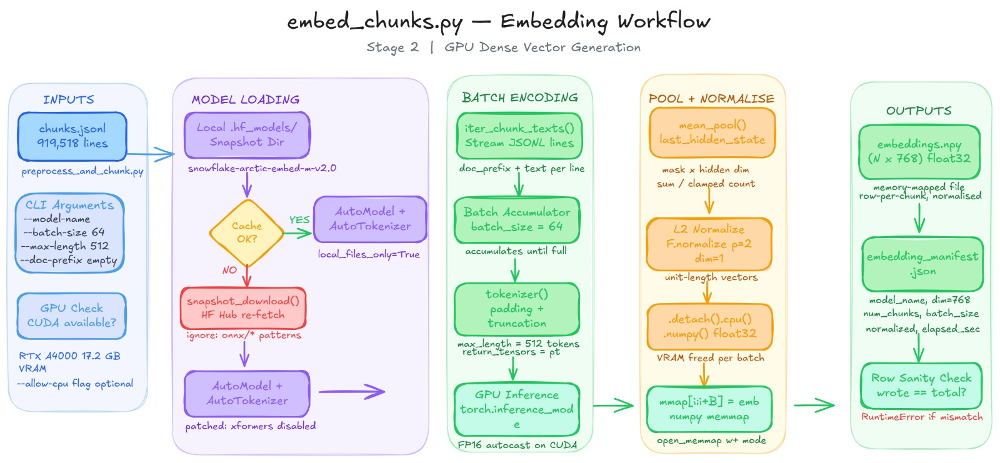
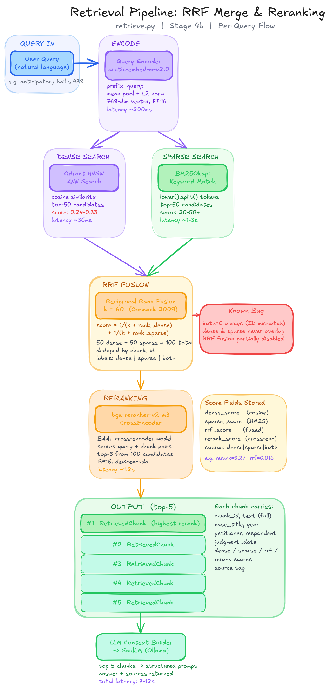
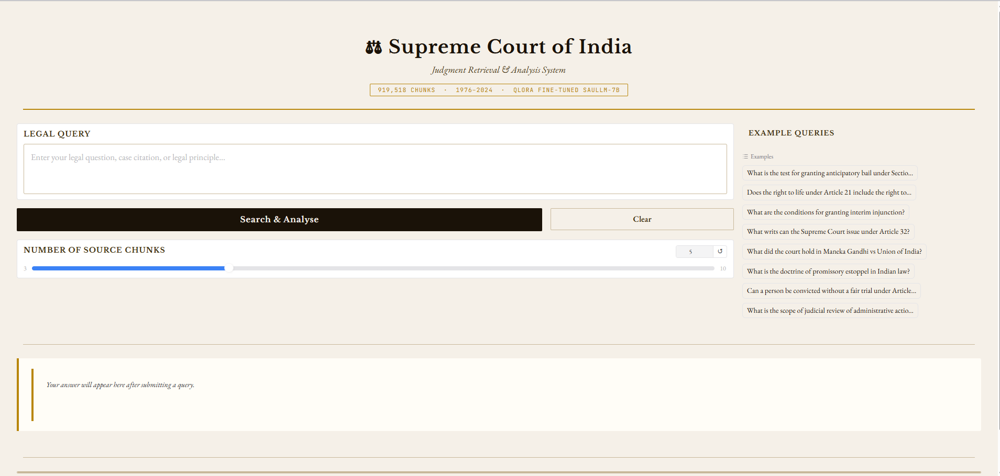

# ⚖️ Supreme Court of India — Legal RAG System

> **919,518 chunks · 1950–2025 · QLoRA Fine-tuned SaulLM-7B · Hybrid Dense + Sparse Retrieval**

A production-grade Retrieval-Augmented Generation (RAG) system for searching and analysing 75 years of Indian Supreme Court judgments. Ask legal questions in plain English and receive structured, citation-backed answers grounded in actual case law.


---

## 📋 Table of Contents

1. [Problem Statement](#1-problem-statement)
2. [Dataset](#2-dataset)
3. [Tech Stack](#3-tech-stack)
4. [System Architecture](#4-system-architecture)
5. [Implementation Stages](#5-implementation-stages)
   - [Stage 1 — Preprocess & Chunk](#stage-1--preprocess--chunk)
   - [Stage 2 — Embed Chunks](#stage-2--embed-chunks)
   - [Stage 3 — Hybrid Indexing](#stage-3--hybrid-indexing)
   - [Stage 4 — Fine-tune & Retrieve](#stage-4--fine-tune--retrieve)
6. [Deployment](#6-deployment)
7. [Quickstart](#7-quickstart)

---

## 1. Problem Statement

Indian Supreme Court judgments span over seven decades and millions of pages of legal text. Legal researchers, advocates, and students face three core challenges:

- **Volume**: Locating the one relevant precedent among hundreds of thousands of judgments is manual, slow, and error-prone.
- **Semantic gap**: Keyword search fails when a question uses different terminology than the judgment (e.g., "right to livelihood" vs. Article 21 jurisprudence).
- **Answer quality**: Generic LLMs hallucinate citations and misstate holdings when asked about specific Indian case law.

This system addresses all three by combining hybrid vector search (dense + sparse) with a domain-specific fine-tuned LLM (SaulLM-7B) that is grounded strictly in retrieved case excerpts — producing structured, citation-backed answers with full latency transparency.

---

## 2. Dataset

| Property | Detail |
|---|---|
| **Source** | Supreme Court of India PDF judgments (judis.nic.in) |
| **Coverage** | 1950 – 2025 (75 years) |
| **Total chunks** | 919,518 text segments |
| **Chunk size** | 1,200 characters with 200-character overlap |
| **Vocabulary** | 1,479,440 unique BM25 tokens |
| **Embedding dim** | 768 (Snowflake Arctic Embed M v2.0) |
| **Fine-tune set** | 8,001 train / 2,001 val (IndicLegalQA format) |

Filenames follow the convention `<Petitioner>_vs_<Respondent>_on_<Date>_<Seq>.PDF`, from which case title, parties, judgment date, and year are parsed automatically.

---

## 3. Tech Stack

| Layer | Technology |
|---|---|
| **PDF extraction** | PyMuPDF (fitz) |
| **Chunking** | Custom recursive character splitter |
| **Dense embeddings** | `Snowflake/snowflake-arctic-embed-m-v2.0` (768-dim, FP16, GPU) |
| **Dense vector store** | Qdrant (Docker, HNSW index, cosine similarity) |
| **Sparse index** | BM25Okapi via `rank_bm25` |
| **Fusion** | Reciprocal Rank Fusion (RRF, k=60) |
| **Reranker** | `BAAI/bge-reranker-v2-m3` CrossEncoder |
| **Base LLM** | SaulLM-7B (legal-domain Mistral variant) |
| **Fine-tuning** | QLoRA — 4-bit NF4, LoRA r=16 / α=32, 3 epochs |
| **LLM serving** | Ollama (GGUF Q4_K_M quantisation) |
| **Web UI** | Gradio |
| **Hardware** | NVIDIA RTX A4000 16 GB · i9-14900K · 64 GB RAM |

---

## 4. System Architecture

The system is a **4-stage offline pipeline** feeding a **real-time retrieval + generation** query layer:

```
Stage 1             Stage 2              Stage 3              Stage 4a
PDF Judgments  →  Dense Embeddings  →  Hybrid Index     →  Fine-tune LLM
(preprocess_      (embed_chunks.py)    (index.py)           (finetune.py)
 and_chunk.py)         ↓                    ↓
                  embeddings.npy      Qdrant + BM25
                                      + chunk_store

                              Stage 4b — Query Time
                    User Query → Encode → Dense + Sparse Search
                              → RRF Fusion → Rerank → SaulLM → Answer
```

---

## 5. Implementation Stages

### Stage 1 — Preprocess & Chunk

**Script:** `preprocess_and_chunk.py`


This stage ingests raw Supreme Court PDF files organised in year-based folders (`1950/`, `1951/`, … `2025/`) and converts them into a uniform `chunks.jsonl` file for downstream embedding.

**What it does:**

1. **PDF text extraction** — Uses PyMuPDF (`fitz`) for fast, accurate page-by-page extraction on both digital and scanned PDFs.
2. **Text cleaning** — Strips page numbers, repeated headers/footers (`SUPREME COURT OF INDIA`, `www.judis.nic.in`, etc.), control characters, and normalises whitespace while preserving paragraph boundaries.
3. **Metadata extraction** — Parses case title, petitioner, respondent, and judgment date directly from the structured filename convention (`Petitioner_vs_Respondent_on_Date_Seq.PDF`) using regex.
4. **Recursive chunking** — Splits text hierarchically: paragraphs → sentences → clauses → words → characters. Each chunk is at most 1,200 characters with 200-character overlap to preserve cross-boundary context.
5. **JSONL output** — Each chunk is written as a JSON object with `chunk_id`, `text`, and a full `metadata` dict (filename, year, case_title, petitioner, respondent, judgment_date, chunk_index, char_count).

**Output:** `chunks.jsonl` — 919,518 lines, one chunk per line.

---

### Stage 2 — Embed Chunks

**Script:** `embed_chunks.py`



This stage converts every text chunk into a dense 768-dimensional float32 vector using a GPU-accelerated embedding model, writing results to a memory-mapped numpy file for zero-copy downstream access.

**What it does:**

1. **Model loading** — Downloads `Snowflake/snowflake-arctic-embed-m-v2.0` to a local `.hf_models/` snapshot directory. Detects and repairs incomplete cached downloads automatically. Disables xformers attention for broader compatibility.
2. **Streaming batch encoding** — Iterates `chunks.jsonl` in batches of 64, tokenises with padding and truncation to 512 tokens, and runs GPU inference in FP16 autocast mode.
3. **Mean pooling + L2 normalisation** — Pools the last hidden state with attention mask weighting, then L2-normalises to unit-length vectors (required for cosine similarity via dot product).
4. **Memory-mapped output** — Writes embeddings to `embeddings.npy` using `numpy.lib.format.open_memmap` in `w+` mode — rows are written batch-by-batch without loading the full matrix into RAM.
5. **Manifest** — Saves `embedding_manifest.json` recording model name, shape, normalisation flag, elapsed time, and hardware details for full reproducibility.

**Output:** `embeddings.npy` — shape `(919518, 768)`, float32, L2-normalised; `embedding_manifest.json`.

---

### Stage 3 — Hybrid Indexing

**Script:** `index.py`


This stage builds two complementary indexes that together power hybrid retrieval — one for semantic understanding, one for exact keyword and citation matching.

**What it does:**

1. **Qdrant dense index** — Creates a `sc_judgments` collection in a Dockerised Qdrant server (`:6333`) with 768-dim HNSW cosine-distance indexing. Upserts all 919,518 vectors in batches of 500 `PointStruct` objects, each carrying `chunk_id`, `case_title`, `year`, `text`, and full metadata as payload.
2. **BM25 sparse index** — Tokenises all chunk texts with `lower().split()` whitespace tokenisation and fits a `BM25Okapi` model (k1=1.5, b=0.75) over the full 919,518-document corpus. Produces a 1,479,440-token vocabulary. Serialised to `bm25_index.pkl` (~1.09 GB).
3. **Chunk store** — Saves parallel arrays of `texts`, `metadatas`, and `ids` to `chunk_store.pkl` (~1.47 GB) — loaded at query time to hydrate BM25 hits with full text and metadata.
4. **Smoke test** — Immediately after indexing, runs 3 representative queries (Article 21, Maneka Gandhi AIR citation, anticipatory bail) through both BM25 and Qdrant, printing top-3 results from each to verify alignment.

**Dense vs Sparse strengths:**

| Qdrant (Dense) | BM25 (Sparse) |
|---|---|
| Semantic / conceptual matching | Exact keyword / citation matching |
| Handles paraphrases & synonyms | Handles AIR citations, section numbers |
| 768-dim cosine similarity | TF-IDF scoring, scores range 20–50+ |
| HNSW ANN search (~36ms) | Full corpus scan (~1–3s) |

**Output:** Qdrant collection `sc_judgments`, `bm25_index.pkl`, `chunk_store.pkl`, `index_manifest.json`.

---

### Stage 4 — Fine-tune & Retrieve

**Scripts:** `finetune.py` (offline, once) + `retrieve.py` (query time)



#### Stage 4a — QLoRA Fine-tuning (`finetune.py`)

SaulLM-7B (a legal-domain Mistral-7B variant) is fine-tuned on the IndicLegalQA dataset to produce structured, citation-grounded answers in Indian legal style.

- **Method**: QLoRA — 4-bit NF4 quantisation + LoRA adapters (r=16, α=32) on all attention and MLP projection layers.
- **Training**: 3 epochs, batch size 2 + 8-step gradient accumulation (effective batch=16), cosine LR scheduler (lr=2e-4), paged AdamW 8-bit. Train loss: 1.29 → 0.27.
- **Dataset**: 8,001 train / 2,001 validation examples. Completion-only training (prompt tokens masked with -100).
- **Output**: LoRA adapter saved to `saullm_indic_legal/`, optionally merged and exported to GGUF (Q4_K_M) for Ollama serving.

#### Stage 4b — Retrieval Pipeline (`retrieve.py`)

The per-query pipeline has 7 steps with full latency instrumentation:

1. **Encode** — Query prefixed with `"query: "` and encoded with arctic-embed-m-v2.0 using mean pooling + L2 norm → 768-dim FP16 vector (~200ms).
2. **Dense search** — Qdrant HNSW ANN returns top-50 semantic candidates by cosine similarity (~36ms, scores 0.24–0.33).
3. **Sparse search** — BM25Okapi keyword match returns top-50 candidates with TF-IDF scores (~1–3s).
4. **RRF fusion** — Reciprocal Rank Fusion (k=60, Cormack 2009) merges and deduplicates 100 candidates: `score = 1/(k + rank_dense) + 1/(k + rank_sparse)`. Labels each result as `dense`, `sparse`, or `both`.
5. **Rerank** — `BAAI/bge-reranker-v2-m3` CrossEncoder scores all query-chunk pairs and selects top-5 (~1.2s, FP16 GPU).
6. **Build context** — Top-5 chunks are formatted into a structured prompt with the system instruction: *"Answer strictly based on the provided case excerpts. Structure: 1. Legal Principle, 2. Leading Case(s), 3. Explanation."*
7. **Generate** — SaulLM fine-tuned model (via Ollama) generates the answer (~4–9s). Total pipeline latency: **7–12s**.

Every query is logged to `query_log.jsonl` with full latency breakdown and source citations.

---

## 6. Deployment

**Script:** `app.py` · **Interface:** Gradio Web UI



`app.py` wraps the `RetrievalPipeline` from `retrieve.py` in a Gradio web interface that launches at `http://localhost:7860`. The pipeline is lazy-loaded on the first query so the UI appears instantly.

**Features:**

- **Legal Query input** — Multi-line text box with Enter-to-submit support.
- **Number of source chunks slider** — Configurable from 3 to 10 (default 5); directly controls `top_k` passed to the retrieval pipeline.
- **8 example queries** — Clickable pre-loaded examples covering bail, fundamental rights, injunctions, writs, and landmark cases.
- **Answer panel** — Rendered Markdown with gold left-border, displaying the structured LLM response.
- **Source Judgments panel** — Each retrieved chunk shown with case name, year, date, rerank score, source tag, and a 300-character preview.
- **Latency panel** — Per-stage timing breakdown (encode / dense / sparse / rerank / LLM / total) in monospace font.
- **Parchment UI theme** — Custom CSS using EB Garamond and Libre Baskerville typography with a legal document aesthetic.

**Run:**

```bash
python app.py
# Opens http://localhost:7860 automatically
```

---

## 7. Quickstart

### Prerequisites

```bash
# Python environment
conda create -n rag python=3.11
conda activate rag
pip install pymupdf tqdm transformers torch numpy qdrant-client rank-bm25 \
            sentence-transformers gradio peft trl bitsandbytes accelerate

# Qdrant (Docker)
docker run -p 6333:6333 -v $(pwd)/qdrant_storage:/qdrant/storage qdrant/qdrant

# Ollama (for LLM serving)
ollama create saullm-legal -f Modelfile
```

### Run the pipeline

```bash
# Stage 1 — chunk all PDFs
python preprocess_and_chunk.py

# Stage 2 — embed chunks (requires GPU)
python embed_chunks.py --batch-size 64 --max-length 512

# Stage 3 — build indexes
python index.py

# Stage 4a — fine-tune LLM (optional, requires 14+ GB VRAM)
python finetune.py --merge

# Stage 4b — query from CLI
python retrieve.py --query "What is the test for anticipatory bail under Section 438?"

# Deployment — launch Gradio UI
python app.py
```

### CLI options

```bash
# Retrieval-only (no LLM, fast)
python retrieve.py --llm-backend none --query "Maneka Gandhi Article 21"

# Use HuggingFace adapter directly (no Ollama)
python retrieve.py --llm-backend hf

# Dry-run indexing (first 5,000 chunks only)
python index.py --dry-run

# Fine-tune dry run (~5 minutes, 200 samples)
python finetune.py --dry-run
```

---

## Project Structure

```
.
├── preprocess_and_chunk.py   # Stage 1: PDF → chunks.jsonl
├── embed_chunks.py           # Stage 2: chunks.jsonl → embeddings.npy
├── index.py                  # Stage 3: embeddings → Qdrant + BM25
├── finetune.py               # Stage 4a: QLoRA fine-tune SaulLM-7B
├── retrieve.py               # Stage 4b: query → hybrid search → answer
├── app.py                    # Gradio web UI
├── Modelfile                 # Ollama model definition for saullm-legal
├── chunks.jsonl              # 919,518 chunks (generated)
├── embeddings_arctic_m_v2/
│   ├── embeddings.npy        # (919518, 768) float32
│   └── embedding_manifest.json
├── index_output/
│   ├── bm25_index.pkl        # ~1.09 GB
│   ├── chunk_store.pkl       # ~1.47 GB
│   └── index_manifest.json
├── saullm_indic_legal/       # LoRA adapter weights
└── .hf_models/               # Local HuggingFace model cache
```

---

## License

This project is released for research and educational purposes. Supreme Court judgment PDFs are public domain under Indian government open data policy. Model weights (SaulLM-7B, Arctic Embed, BGE Reranker) are subject to their respective upstream licences.
